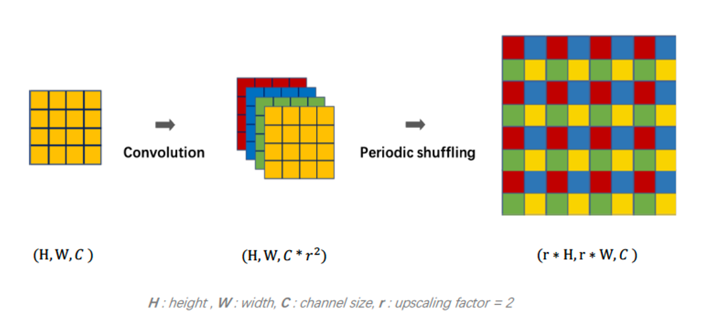
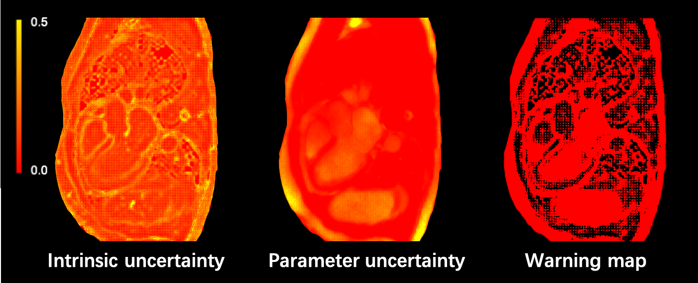

# 2D super-resolution on cardiac MR images

A Keras implementation of super-resolution ResNet from ["Photo-Realistic Single Image Super-Resolution Using a Generative Adversarial Network"](https://arxiv.org/abs/1609.04802), as a part of a master thesis project "Super-resolving cardiac MR images using deep learning" at Linköping University.

Super-resolution on 3D cardiac MR volumes (using PyTorch) can be found [here](https://github.com/junnjun/3D-Super-resolution) (private at the moment)

## Dataset

2D balanced-ssfp slices were used for training/inference. 2D slices were obtained from cine balanced-ssfp volume with spatial resolution of 1 x 1 x 8 mm^3. Obtained 2D slices are used as a hight-resolution target for training the network. Low-resolution input was created by downsampling with bicubic interpolation and adding Gaussian blurring with sigma = 1.0. 

## Network architecture and more

Super-resolution ResNet (SRResNet) is a generator network of super-resolution generative adversarial network (SRGAN). SRResNet is composed of 16 residual blocks with local skip connections and one global skip connection, and 2 upscaling blocks with MSE as loss function. The network adopts pixel shuffler as its upscaling method, where convolution is performed before upscaling in each block.

[Pixel-shuffler](https://arxiv.org/abs/1609.05158) upscales the input from the previous layer by rearranging the pixel from its feature map. With the input size of H(height) x W(width) x C(channel size), it first increases the number of its channels by r^2 where r denotes the upscaling factor. Then it performs
periodic shuffling which maps the input space from depth   to space  

<p align="center">
  
</p>

In this project following experiments were of interest :  first,  loss function <code> <b>perceptual loss VS MSE loss</b> </code> and second, upscaling method (upscaling factor x4) <code> <b> pixel-shuffler VS nearest-neighbor interpolation</b> </code>. Also, a different order of sequence of layers in the upscaling block was tested (Model 1 vs Model 5). The proposed combination of the network architecture of SRResNet from the paper is listed under Model 1.

|         |  Loss function  | Upscaling method |    Sequence of Layer    |
|:-------:|:---------------:|:----------------:|:-----------------------:|
| Model 1 |     MSE loss    |  Pixel-shuffler  | Convolution then Resize |
| Model 2 | Perceptual loss |  Pixel-shuffler  | Convolution then Resize |
| Model 3 |     MSE loss    | NN interpolation | Convolution then Resize |
| Model 4 | Perceptual loss | NN interpolation | Convolution then Resize |
| Model 5 |    Mse loss     |  Pixel-shuffler  | Resize then Convolution |

## Training detail
Training was performed on a workstation with a 3.6GHz, 6-core processor with 64GB RAM, NVIDIA Quadro P6000 GPU.

## Usage
Activate virtual environment (see requirements.txt) and simply run the code by e.g. <code>python train.py</code>
### Train
```shellscript
usage: train.py [-h] [--init_epoch INIT_EPOCH] [--num_epoch NUM_EPOCH] [--batch_size BATCH_SIZE]
                [--mode MODE] [--loss LOSS] [--upscale_factor UPSCALE_FACTOR] [--LR_input_size LR_INPUT_SIZE]
                [--train_data_dir TRAIN_DATA_DIR] [--val_data_dir VAL_DATA_DIR] [--HR_folder HR_FOLDER] [--LR_folder LR_FOLDER]
                [--load_weight_dir LOAD_WEIGHT_DIR] [--save_weight_dir SAVE_WEIGHT_DIR] [--log_dir LOG_DIR]

optional arguments:
-h, --help                 for more help on parameters 
--init_epoch               initial epoch (default:0), if you want to continue training from previous training, set initial_epoch to begin training with
--num_epoch                number of epochs (default:20)
--batch_size               training batch size (default:16)
--mode                     upscaling method, two options: 'NN' for NN interpolation, 'PS' for pixel-shuffler
--loss                     loss function, two options: 'perceptual' for perceptual loss, 'mse' for MSE loss
--upscale_factor           upscale factor (default:x4)
--LR_input_size            if the size of the input low-resolution image is 88x88 then type in 88 (default:88)
--train_data_dir           path to training dataset, must contain LR_folder and HR_folder
--val_data_dir             path to the validation dataset, must contain LR_folder and HR_folder
--HR_folder                where low-resolution data are saved, specify the folder name
--LR_folder                where high-resolution data are saved, specify the folder name
--load_weight_dir          path to load saved weight to continue training, otherwise set to None (default:None)
--save_weight_dir          path to save training weights
--log_dir                  log directory for tensorboard
```

### Inference
```shellscript
usage: evaluate.py [-h] [--upscale_factor UPSCALE_FACTOR] [--mode MODE] [--loss LOSS] [--LR_input_size LR_INPUT_SIZE]
                   [--test_data_dir TEST_DATA_DIR] [--HR_folder HR_FOLDER] [--LR_folder LR_FOLDER]
                   [--load_weight_dir LOAD_WEIGHT_DIR] [--save_result_dir SAVE_RESULT_DIR] 
  
optional arguments:
-h, --help                 for more help on parameters
--batch_size               batch size used for training the network
--upscale_factor           upscale factor (default:x4)
--mode                     upscaling method, two options: 'NN' for NN interpolation, 'PS' for pixel-shuffler
--loss                     loss function, two options: 'perceptual' for perceptual loss, 'mse' for MSE loss
--LR_input_size            if the size of the input low-resolution image is 88x88 then type in 88 (default:88)
--test_data_dir            path to test dataset, must contain LR_folder and HR_folder
--HR_folder                where low-resolution data are saved, specify the folder name
--LR_folder                where high-resolution data are saved, specify the folder name
--load_weight_dir          path to saved weight/checkpoint
--save_result_dir          where generated SR images will be saved
```


## Results

|         |  Loss |  PSNR |  SSIM  | Training time per epoch |
|:-------:|:-----:|:-----:|:------:|:-----------------------:|
| Model 1 |  0.02 | 17.15 | 0.7865 |           54m           |
| Model 2 | 15.37 | 10.66 | 0.6526 |          1h 9m          |
| Model 3 |  0.04 | 14.04 | 0.6526 |          2h 11m         |
| Model 4 | 16.93 | 10.79 | 0.5495 |          2h 26m         |
| Model 5 |  0.02 | 16.62 | 0.7518 |          2h 14m         |


- Model 1 (MSE loss & Pixel-shuffler & Convolution then Resize)
<table>
  <tr>
    <td>ground-truth HR</td>
     <td>bicubic interpolation</td>
     <td>generated SR</td>
  </tr>
  <tr>
    <td valign="top"></td>
    <td valign="top"></td>
    <td valign="top"></td>
  </tr>
 </table>

- Model 2 (Perceptual loss &  Pixel-shuffler & Convolution then Resize)
<table>
  <tr>
    <td>ground-truth HR</td>
     <td>bicubic interpolation</td>
     <td>generated SR</td>
  </tr>
  <tr>
    <td valign="top"></td>
    <td valign="top"></td>
    <td valign="top"></td>
  </tr>
 </table>

- Model 3 (MSE loss & NN interpolation & Convolution then Resize)
<table>
  <tr>
    <td>ground-truth HR</td>
     <td>bicubic interpolation</td>
     <td>generated SR</td>
  </tr>
  <tr>
    <td valign="top"></td>
    <td valign="top"></td>
    <td valign="top"></td>
  </tr>
 </table>

- Model 4 (Perceptual loss & NN interpolation & Convolution then Resize)
<table>
  <tr>
    <td>ground-truth HR</td>
     <td>bicubic interpolation</td>
     <td>generated SR</td>
  </tr>
  <tr>
    <td valign="top"></td>
    <td valign="top"></td>
    <td valign="top"></td>
  </tr>
 </table>

- Model 5 (Mse loss & Pixel-shuffler & Resize then Convolution)
<table>
  <tr>
    <td>ground-truth HR</td>
     <td>bicubic interpolation</td>
     <td>generated SR</td>
  </tr>
  <tr>
    <td valign="top"></td>
    <td valign="top"></td>
    <td valign="top"></td>
  </tr>
 </table>
 
 
 ## Uncertainty maps and Warning map


|         | Intrinsic uncertainty | Parameter uncertainty | Warning map |
|:-------:|:---------------------:|:---------------------:|:-----------:|
| Model 1 |         20691         |         18434         |     0.5     |
| Model 2 |         19273         |         19023         |     0.46    |
| Model 3 |         39722         |         25523         |     0.99    |
| Model 4 |         19386         |         17737         |     0.95    |
| Model 5 |         18752         |         17452         |     0.27    |

More details of uncertainty maps and warning map can be found [here](https://github.com/junnjun/Uncertainty-Estimation-for-Deep-Learning-based-SISR)
<table>
  <tr>
    <td>Model 1</td>
     <td>Model 2</td>
  </tr>
  <tr>
    <td valign="top"></td>
    <td valign="top"></td>
  </tr>
    <tr>
    <td>Model 3</td>
     <td>Model 4</td>
  </tr>
  <tr>
    <td valign="top"></td>
    <td valign="top"></td>
  </tr>
    <tr>
    <td>Model 5</td>
  </tr>
  <tr>
    <td valign="top"></td>
  </tr>
 </table>
 
Warning map is a binary map (0/1) with threshold  = 0.19. Black indicates ‘safe’ pixels , and red indicates ‘risky’ pixels. 


